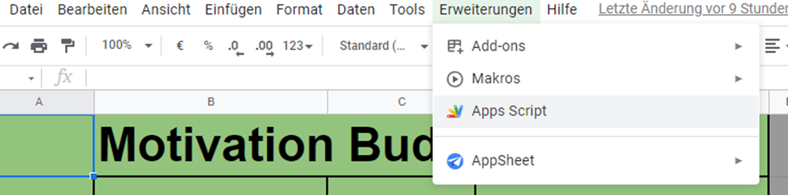

# Motivation_Buddy
A little IoT Device for Motivation and personal Messages.  
 

(just for fun and definitely has no CE certificate and not China Exportet since it is made at home (Please don't sue me. The Logo is just for fun :) ))

## What is it?
The Motivation Buddy is a little device, that can display a Motivation Quoate every hour or so. You can also hook it up to your WIFI to send messages and pre-set images to the screen. I designed this project as a gift. 

If you do not want to hook it up to Wifi it just displays a random quote which changes from time to time (i think - haven't tested it)

## Required Hardware:
- [ESP8266 D1 Mini](https://www.az-delivery.de/it/products/d1-mini-pro)
- [0.96 Inch Oled I2C Display](https://www.az-delivery.de/it/products/0-96zolldisplay?_pos=1&_sid=81bd66783&_ss=r)
- 4x [M2x6](https://www.amazon.de/Schrauben-Edelstahl-Sechskopf-Unterlegscheiben-Aufbewahrung/dp/B085LJYF3G/ref=pd_sbs_2/257-8556461-8818023?pd_rd_w=WwLyA&pf_rd_p=8781501c-593f-4975-b5f8-e088bd855b50&pf_rd_r=K4869HAYNW4F58S6GAJ7&pd_rd_r=3e6d37be-0675-4f66-af95-faa65efe84dc&pd_rd_wg=jdNy0&pd_rd_i=B085LJYF3G&psc=1)
- Brass Inserts 4x [M2x4x3.5](https://www.amazon.de/VIGRUE-Gewindeeinsatz-Einpressmutter-Gewindebuchsen-Kunststoffteiledurch/dp/B08DHYD73Q/ref=sr_1_4?__mk_de_DE=%C3%85M%C3%85%C5%BD%C3%95%C3%91&crid=3O62TU9BSAS4I&keywords=brass+inserts&qid=1644755613&s=diy&sprefix=brass+inserts%2Cdiy%2C161&sr=1-4) 
- 4x 4cm Wire (2 [Arduino Jumper](https://www.amazon.de/Female-Female-Male-Female-Male-Male-Steckbr%C3%BCcken-Drahtbr%C3%BCcken-bunt/dp/B01EV70C78/ref=sr_1_5?keywords=jumper+cables&qid=1644755637&sprefix=jumper+%2Caps%2C85&sr=8-5) cables cut in halfe work too)

## Additionally: 
- [Arduino IDE](https://www.arduino.cc/en/software) addapted for [ESP8266](https://chewett.co.uk/blog/937/configuring-wemos-d1-mini-pro-esp8266-arduino-ide/)
- Solderin Iron 
- Solder
- 3D Printer 

## How to [Hardware]:

### 1) 3D Printing  
3D print the case and cover from the latest version in [3dModells](./3dModells/). I used the [colorFabb Steelfill PLA Filament](https://colorfabb.com/de/steelfill) for a High-Quality feeling and a bit of extra weight. 

Printer: 
- Ender 3 Pro
    
Print Settings (Cura 4.12.1): 
- Steal Nozzel 0.6mm
- Bed Tmp: 60°
- Nozzle: 215°
- Speed: 50mm/s
- Support: Tree, touching build plate
 - Retraction: 5mm

### 2) Soldering  
Solder the display to the ESP8266 D1 mini as shown below: 

image from [electronics-lab.com]( https://www.electronics-lab.com/project/network-clock-using-esp8266-oled-display/)

### 3) Inserts
Use the soldering iron to insert the Brass Inserts into the 4 holes in the base of the case. 

### 4) Asembly 
- Push the Oled display gently (but with a little bit of force) into the cover, so that the 4 pins of the oled align with the cutout in the back and only the display is visible from the front. 
- Put the ESP8622 into the casing and align it with the usb cutout. 
- Choose and orientation of the display-cover (it is a square so you can rotate it) and put it gently on top. Make sure the wires go around the WeMos Processor. 
- Gently screw in the 4 screws in each corner. 
   
## How to [Software]:
1) Create a Google spreadsheet (See the [MotivationBuddy.xlsx](./Software/MotivationBuddy.xlsx) as template)
2) Navigate to Extensions -> "Apps Script" (see image below)

3) copy the [Google Doc Script](./Software/google_doc_excel_script.txt) into the Apps Script and enter the URL in the first line. 
4) Go to Deploy and then "new deployment"
5) Select Web App and set the authorisation to "everyone" 
6) Copy the generated code to the [settings.h](./Software/Motivation_Buddy_V2/settings.h) file at the variable "GOOGLE_SCRIPT_ID" . 
7) At the  [settings.h](./Software/Motivation_Buddy_V2/settings.h) also enter your Wifi Network settings. 
8) Kompile and Flash your [.ino Script](./Software/Motivation_Buddy_V2/Motivation_Buddy_V2.ino) to your ESP8266

9) (Optional) Change the Bitmaps to a image you like or create new .h-files with new bitmaps (dont forget to change the Switch-Case statement if you do). Images can be converted [here](https://diyusthad.com/image2cpp) (external converter for image to cpp bitmap)
## (Optional) Packaging
1) "Product" Info-Card  
If you want to make the gadget look more like a product print out the [Front](./Packaging/Front.png) and [Back](./Packaging/Back.png) of the provided "Info"-Card. 

2) Cardboard Box  
Get a Box roughly the size of <19 x 12.5 x 4.5 cm>  

3) Power Supply  
Get a power supply and put it in the box

4) Print the inlay  
3D Print the [inlay](./Packaging/inlay.stl) 

5) Bubble Wrap  
Bubble Wrap the Gadget and put it in the Inlay. 

6) READY!  
Send it out to your loved onces or Hustle-Buddies

## What now?
If you have any suggestions or want to change something please do so but contact me. I am interested how this porject can be used. 

Do you want to sell it? -> Contact me and lets talk about it 

## Sources: 
Circuit Image: https://www.electronics-lab.com/project/network-clock-using-esp8266-oled-display/
 
Code Idea and Tutorial: https://www.youtube.com/watch?v=0LoeaewIAdY  
Thingiverse Model inspirations: https://www.thingiverse.com/thing:857858